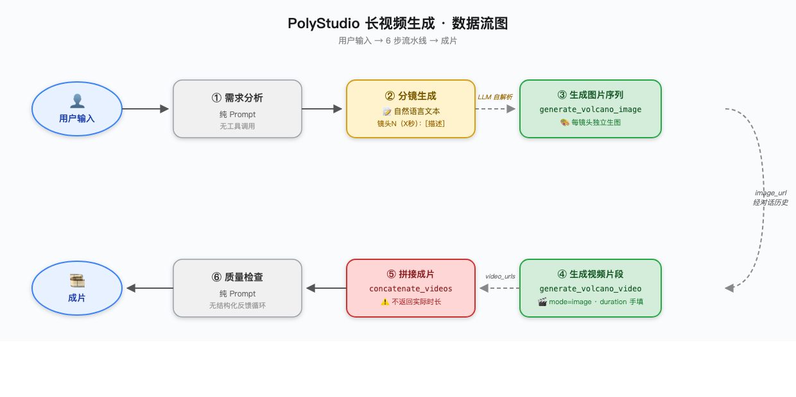
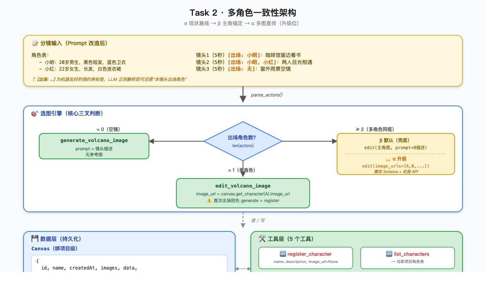

# 第 4 周作业 · 解答

> 关联文档：[作业要求](作业要求.md)
> 关联代码：`~/development/AIGC/learning/AI_Video/week-04/PolyStudio/`
> GitHub 提交仓库：（待填）

---

## Task 1 · 当前长视频 Agent 基础能力分析

> **代码依据**
> Prompt：[`agent_service.py`](backend/app/services/agent_service.py) L75-77、L82-134
> 工具：[`volcano_image_generation.py`](backend/app/tools/volcano_image_generation.py)、[`volcano_video_generation.py`](backend/app/tools/volcano_video_generation.py)、[`video_concatenation.py`](backend/app/tools/video_concatenation.py)

### 1.1 现有工作流

**六步链路**（Prompt L82-134 规定）：

| # | 阶段 | 类型 | 工具 |
|---|------|------|------|
| ① | 需求分析 | 纯 Prompt | — |
| ② | 分镜生成 | 纯 Prompt | — |
| ③ | 生成图片序列 | 工具调用 | `generate_volcano_image` |
| ④ | 生成视频片段 | 工具调用 | `generate_volcano_video`（mode=`image`）|
| ⑤ | 拼接成片 | 工具调用 | `concatenate_videos` |
| ⑥ | 质量检查 | 纯 Prompt | — |

**数据传递（混合态）**

- **结构化层**：工具调用的入参与返回是 JSON，按 Prompt L75-77 自动落入 `messages` 对话历史
- **非结构化层**：分镜本身是 LLM 输出的**自然语言段落**——下游每一步生图/生视频时，LLM 必须**重新解析自己上一轮输出**，手工提取"镜头序号 / 描述 / 时长"，再填到工具参数里

> 💡 **结论**：短板在**分镜层无结构化中间态**，不在工具调用层。

---

### 1.2 现有角色一致性

| 子问题 | 现状 |
|--------|------|
| **如何保证多镜头一致？** | 长视频流程未规定，仅靠每镜头 `generate` 时 prompt 文字一致 |
| **依赖什么输入？** | Prompt 未要求任何角色参考图作为必备输入 |
| **edit vs generate？** | Prompt L107-111 明文规定**用 `generate`**；`edit_volcano_image` 虽已注册（L30）但长视频流程未引用 |
| **Prompt 中的规则？** | 全文 **0 处**出现"角色 / 主角 / 人物"；唯一相关约束是"风格一致（相同主题、相似色调、统一尺寸）" |

> ⚠️ **结论**：**长视频流程下，角色一致性无任何显式机制**。作业题干说的"基于同一张角色图做 `edit`"是用户在普通对话里的外挂玩法，**不是 Prompt 工作流的一部分**。

---

### 1.3 现有时长处理

| 子问题 | 现状 |
|--------|------|
| **分镜中如何体现时长？** | 文本格式 `镜头N（X秒）：[描述]`（Prompt L94-104 示例） |
| **单段时长谁决定？** | **LLM 读分镜文本后手动填** `duration` 参数；默认 5 秒，范围 4-12 秒（[L479](backend/app/tools/volcano_video_generation.py#L479)）|
| **总时长校验？** | ❌ 仅 Prompt L116 一句"确保总和不超过总时长" → **靠 LLM 心算** |
| **接口返回 ≠ 请求 怎么处理？** | ❌ **完全不处理** |

**两条铁证（拼接工具的"时长黑洞"）**

| 文件 | 现象 |
|------|------|
| [`video_concatenation.py` L217](backend/app/tools/video_concatenation.py#L217) | 内部拿到 `final_clip.duration`，**只写日志** |
| [`video_concatenation.py` L300-306](backend/app/tools/video_concatenation.py#L300-L306) | 返回 JSON 字段：`video_url / video_count / output_filename / message` —— **无 duration** |
| [`volcano_video_generation.py` L572](backend/app/tools/volcano_video_generation.py#L572) | 返回的 `duration` 是**请求值原样回填**，非 API 实际返回值 |

> 🔴 **结论**：LLM 全程拿不到任何"实际时长"信号，"接口返回时长 ≠ 请求"的情况完全不处理。

---

### 1.4 数据流图



---

## Task 2 · 多角色一致性扩展方案

### 🎯 30 秒看懂

| 问题 | 解法 | 类比 |
|---|---|---|
| 系统现在只能记住"最近一张图"，多角色就乱 | 给项目加一本**"角色通讯录"** | 通讯录 |
| 分镜里 LLM 读不准"本镜头有谁" | 在每个镜头加 `[出场: A, B]` 标签 | 剧本台头 |
| Agent 不知道该用 generate 还是 edit | 按"出场几个人"走 **3 条路** | 厨师烹饪流程 |

> **从 Task 1 实测得出的设计起点**：长视频流程当前是 **σ 模式**（5 次 generate, 0 次 edit，仅靠 prompt 文字描述维持一致性）。Task 2 把流程拉到 **β 模式**（用 edit + 参考图锚定每个角色）。

---

### 2.1 给系统加一本"角色通讯录"

> **本节一句话**：给项目（Canvas）加一份"角色名 → 参考图"的查询表，让系统能同时记住多个角色。

**问题来源**：现在系统记不住多个角色，因为它没**结构化存储**——只能从对话历史里翻"最近的图"。

**解法**：每个项目里维护一份角色通讯录，每条记录长这样——

| 角色名 | 参考图 | 一句话外貌 |
|---|---|---|
| 张伟 | `/storage/张伟.jpg` | 35 岁男程序员，黑框眼镜+蓝衬衫 |
| 李娜 | `/storage/李娜.jpg` | 28 岁女设计师，长卷发+红毛衣 |

**通讯录怎么填？** 通过新增的 `register_character` 工具——LLM 第一次给某角色生图后，自动调用这个工具把"名字+图片"存进通讯录。

<details>
<summary>📐 数据结构代码（点开看）</summary>

加在 [`history_service.py:11`](backend/app/services/history_service.py#L11) 的 `Canvas` 类里：

```python
class Character(BaseModel):
    name: str         # "张伟"  → LLM 用这个名字交流
    image_url: str    # "/storage/images/xxx.jpg"  → 参考图地址
    description: str  # "35岁男，黑框眼镜+蓝衬衫"  → 多角色同框时兜底用

class Canvas(BaseModel):
    id: str
    name: str
    # ... 已有字段 ...
    characters: List[Character] = []   # ← 新增"通讯录"
```

`Pydantic BaseModel` 是项目已有的数据类，加新字段不会破坏旧数据（默认值是空列表）。

</details>

---

### 2.2 在分镜里标好"这镜头有谁"

> **本节一句话**：在每个镜头描述前加 `[出场: ...]` 标签，让 LLM 不用"读懂句子"就知道这镜头要用哪些角色。

**问题来源**：现在分镜是纯自然语言段落，LLM 要靠读句子推理"本镜头有谁"——容易漏、容易加。

**解法**：在每个镜头描述前加一个**机器友好的标签** `[出场: ...]`：

**改造前** ❌
```
镜头1（5秒）：张伟在工位敲代码
镜头3（5秒）：两人在茶水间冲咖啡
```

**改造后** ✅
```
角色表：
- 张伟：35 岁男程序员，黑框眼镜+蓝衬衫
- 李娜：28 岁女设计师，长卷发+红毛衣

镜头1（5秒）[出场: 张伟]：在工位敲代码
镜头2（5秒）[出场: 李娜]：在工位画设计稿
镜头3（5秒）[出场: 张伟, 李娜]：两人茶水间冲咖啡
镜头4（5秒）[出场: 无]：办公室空镜，夕阳从窗户照进来
```

**好处**：

- LLM 只需**正则匹配**（一行代码）就能精确知道这镜头要哪些角色
- 人也能一眼看清，不需要 AI 解析

---

### 2.3 Agent 按"出场几个人"走 3 条路

> **本节一句话**：拿到一个镜头后，看 `[出场: ...]` 里有几个角色，按下表分 3 种情况干活。

**问题来源**：有了通讯录（2.1）和标签（2.2），还需要"决策大脑"把它们组装起来——决定用 generate 还是 edit、传哪张参考图。

**解法**：**按出场角色数分 3 种情况**——

| 情况 | 出场几人 | 用什么工具 | 传什么参考图 | Prompt 写啥 |
|---|---|---|---|---|
| 🌅 **空镜** | **0 人** | `generate` | 不传 | 镜头描述 |
| 👤 **单人** | **1 人** | `edit` | 该角色的参考图 | 镜头描述 |
| 👥 **多人同框** | **2+ 人** | `edit` | **主角**的参考图 | 镜头描述 + 其他角色的文字描述 |

**单人情况下还有个小细节**：

- 该角色**已经登记过** → 直接用参考图 `edit`
- 该角色**首次出场**（通讯录还没他）→ 先 `generate` 一张 + 调 `register_character` 把他存进通讯录

**多人同框（2+ 人）的两条路**：

| 路径 | 怎么做 | 状态 |
|---|---|---|
| **β 默认（兜底）** | 传**主角**参考图，Prompt 里描述其他角色 | ✅ 当前架构能直接跑 |
| **α 进阶（升级）** | 传**所有角色的参考图数组** | ⚠️ 需改 Schema + 实测 API |

α 路径更精确（每个角色都有像素锚定），但需要先改代码 Schema 让工具接受图片数组——见 §2.6 落地路径。

<details>
<summary>📐 完整伪代码（点开看）</summary>

```python
def render_shot_image(canvas, shot):
    actors = parse_actors(shot)   # 解析 [出场: A, B] → ["A", "B"]

    # ─ 情况 0：空镜 ────────────────
    if len(actors) == 0:
        return generate_volcano_image(prompt=shot.description)

    # ─ 情况 1：单角色 ──────────────
    if len(actors) == 1:
        char = canvas.get_character(actors[0])
        if char and char.image_url:
            # 已登记 → 用参考图 edit
            return edit_volcano_image(
                image_url=char.image_url,
                prompt=shot.description,
            )
        else:
            # 首次出场 → generate + 登记
            new_img = generate_volcano_image(
                prompt=shot.description + (char.description if char else "")
            )
            register_character(name=actors[0], image_url=new_img, description=...)
            return new_img

    # ─ 情况 2：多角色同框（β 默认）──────────────
    primary = actors[0]
    primary_ref = canvas.get_character(primary).image_url
    others_desc = "; ".join([
        f"另有{a}：{canvas.get_character(a).description}"
        for a in actors[1:]
    ])
    return edit_volcano_image(
        image_url=primary_ref,
        prompt=f"{shot.description}; {others_desc}",
    )

    # ─ α 升级方向（待 Schema 改造 + API 实测）──
    # refs = [canvas.get_character(a).image_url for a in actors]
    # return edit_volcano_image(image_urls=refs, prompt=shot.description)
```

</details>

---

### 2.4 让 Agent 真按这套规则走——改 Prompt 4 处

> **本节一句话**：上面 3 节是"设计图"，要让 Agent 真这么干，必须改它的 Prompt（[`agent_service.py`](backend/app/services/agent_service.py) 的长视频工作流段）。

| # | 改在哪里 | 改什么 |
|---|---|---|
| ① | **新增一节《角色管理》** | 介绍 `register_character` 工具，说明何时调用 |
| ② | **步骤 2「分镜生成」** | 把模板改成"必须先列角色表 + 每镜头标 `[出场: ...]`" |
| ③ | **步骤 3「生成图片序列」** | 从"用 generate 生图"改成"先解析 `[出场]` → 走三叉决策" |
| ④ | **全局新增一条** | "角色首次生成完图必须立刻调 `register_character` 落库" |

同时在 [`agent_service.py:30`](backend/app/services/agent_service.py#L30) 工具列表追加 `register_character_tool` 和 `list_characters_tool`。

---

### 2.5 架构图



---

### 2.6 落地路径建议

**最小可行实现**（≈1 天工作量）：

1. `Canvas` 模型加 `characters` 字段，`HistoryService` 加 `add_character / get_character / update_character_image` 方法
2. 新增 `register_character_tool` / `list_characters_tool`，在 `agent_service.py:26-34` 注册
3. 改写长视频工作流 Prompt（4 处改动）
4. 实测一组多角色长视频，对比 β 与 σ 的一致性

**进阶 α 升级**（额外 ≈0.5 天）：

5. `EditVolcanoImageInput` 改为 `image_url: Union[str, List[str]]`
6. `prepare_image_input` 支持列表批量处理
7. 实测火山 API 是否真支持图片数组（注释里说"或数组"但需验证）

---

## 附录 · 基线测试报告（σ 模式实证）

> **目的**：在 Task 2 改造之前，先实测当前长视频流程的真实表现，建立"σ 纯文生图"基线。
> **测试时间**：2026-04-26 18:37–18:47
> **测试日志**：[`backend/logs/polystudio_20260426.log`](backend/logs/polystudio_20260426.log) L1203-1616

### A.1 测试设计

- **2 角色外貌反差大**：张伟（35 岁男，黑框眼镜，蓝色格子衬衫）vs 李娜（28 岁女，长卷发，亮红色毛衣，金属耳钉）
- **5 镜头覆盖三叉**：单角色 ×2 + 双角色同框 ×2 + 空镜 ×1
- **总时长**：5 镜头 × 5 秒 = 25 秒

### A.2 工具调用实证

| 时间 | 工具 | 镜头 |
|---|---|---|
| 18:37:47 | 🎨 `generate_volcano_image` | 镜头 1：张伟敲代码 |
| 18:38:12 | 🎨 `generate_volcano_image` | 镜头 2：李娜画稿 |
| 18:38:38 | 🎨 `generate_volcano_image` | 镜头 3：双人茶水间 |
| 18:39:01 | 🎨 `generate_volcano_image` | 镜头 4：空镜 |
| 18:39:25 | 🎨 `generate_volcano_image` | 镜头 5：双人下班 |
| 18:39:58 ~ 18:46:11 | 🎬 `generate_volcano_video` × 5 | 各 5 秒 |
| 18:47:33 | 🔗 `concatenate_videos` | 拼接成 25 秒成片 |

| 工具 | 调用次数 |
|---|---|
| `generate_volcano_image` | **5** |
| `edit_volcano_image` | **0** |
| `generate_volcano_video` | 5 |
| `concatenate_videos` | 1 |

> ⚠️ **铁证**：**0 次 `edit`**——完全坐实 Task 1 ② 的结论"长视频流程下角色一致性无任何显式机制，仅靠 `generate` 时 prompt 文字"。

### A.3 五张生成图（按镜头顺序）

| 镜头 | 图 | 一致性观察 |
|---|---|---|
| 镜头 1<br>张伟单人 |  | 黑框眼镜 ✅、蓝色格子衬衫 ✅ |
| 镜头 2<br>李娜单人 |  | 长卷发 ✅、红色毛衣 ✅、圆扣耳钉 ✅ |
| 镜头 3<br>双人茶水间 |  | 服饰对 ✅，但**张伟脸型与镜头 1 不同**；李娜耳钉变成大圆环（与镜头 2 不一致）⚠️ |
| 镜头 4<br>空镜 |  | LLM 没脑补加人 🎉，纯办公环境 ✅ |
| 镜头 5<br>双人下班 |  | 仅背影，服饰对 ✅，人脸无法判断 |

### A.4 五项观察 vs 预期对比

| # | 观察项 | 实测 | 我的预期 | 评价 |
|---|---|---|---|---|
| 1 | edit 调用次数 | **0 次** | 0 次 | ✅ 完全符合 |
| 2 | 张伟跨镜头一致性 | 服饰稳定，**人脸漂移** | 不一致 | ⚠️ 部分一致 |
| 3 | 李娜跨镜头一致性 | 服饰稳定，**配饰款式变** | 不一致 | ⚠️ 部分一致 |
| 4 | 双人同框混淆？ | 没混淆（性别/服饰都对） | 大概率混淆 | 🎉 比预期好 |
| 5 | 空镜：脑补加人？ | 没加，真空镜 | 可能加人 | 🎉 比预期好 |

### A.5 关键发现（与 Task 2 设计直接相关）

#### 发现 A：σ 模式下 LLM 自发"prompt 重复外貌"自救

每次 generate 时，LLM 都把「张伟戴黑框眼镜蓝色格子衬衫，李娜长卷发亮红色毛衣戴金属耳钉」**主动塞进 prompt**。这是 LLM 自救行为，**不是 Prompt 规定**。效果：

- ✅ **服饰/性别**：稳定
- ❌ **人脸**：每张都是新人脸（镜头 1 vs 镜头 3 的张伟一眼看出不是同一人）
- ❌ **配饰细节**：耳钉款式变化（圆扣 → 大圆环）

**结论**：σ 自救能锁住"宏观特征"，但锁不住"像素级身份"。Task 2 的 β 改造（用 `edit` 锚定参考图）正是补这一块。

#### 发现 B：时长黑洞实证 ⭐

| 项 | 值 |
|---|---|
| 用户请求总时长 | 25 秒 |
| log 内部实际总时长（[`video_concatenation.py:217`](backend/app/tools/video_concatenation.py#L217)）| **25.25 秒** |
| LLM 拿到的 duration | **25 秒**（请求值原样回填，[`volcano_video_generation.py:572`](backend/app/tools/volcano_video_generation.py#L572)）|

**实测漂移 +0.25 秒**——证实 Task 1 ③ 的结论"接口返回时长 ≠ 请求"，且 **LLM 全程不知情**（拼接工具不返回 duration 字段）。

#### 发现 C：β 改造的预期收益（基于本基线）

| 维度 | σ 现状（实测）| β 预期 |
|---|---|---|
| 服饰一致性 | ~70%（prompt 文字）| ~95%（edit 像素锁定）|
| **人脸一致性** | **~30%**（每镜头新脸）| **~90%**（参考图锚定）|
| 配饰一致性 | ~40% | ~85% |

---

### A.6 β 实测：σ vs β 对照报告 ⭐

> **目的**：验证 §2.4 所述 Prompt 改造方案是否真有效——纯改 Prompt（0 行新代码）能否让 LLM 从 σ 切换到 β？
> **测试时间**：2026-04-26 19:52–20:01
> **改动文件**：[`backend/app/services/agent_service.py`](backend/app/services/agent_service.py) L107-111 步骤 3 加入"角色一致性规则"
> **测试 prompt**：与 §A.1 完全相同（控制实验）

#### A.6.1 工具调用对比

| 镜头 | σ（基线）| β（Prompt 改造后）| 切换？ |
|---|---|---|---|
| 1 张伟单人 | 🎨 generate | 🎨 generate（首次出场）| 不变 |
| 2 李娜单人 | 🎨 generate | 🎨 generate（首次出场）| 不变 |
| **3 双人茶水间** | 🎨 generate | 🖌️ **edit**（image_url=张伟单人图）| ⭐ **切换** |
| 4 空镜 | 🎨 generate | 🎨 generate（无角色）| 不变 |
| **5 双人下班** | 🎨 generate | 🖌️ **edit**（image_url=镜头3 双人图）| ⭐ **切换** |

| 工具 | σ | β | Δ |
|---|---|---|---|
| `generate_volcano_image` | 5 | 3 | **−2** |
| `edit_volcano_image` | **0** | **2** | **+2** ⭐ |
| `generate_volcano_video` | 5 | 5 | 0 |
| `concatenate_videos` | 1 | 1 | 0 |

**Log 实证**：
- `edit` 调用 1：[`polystudio_20260426.log` L1705](backend/logs/polystudio_20260426.log)
- `edit` 调用 2：[`polystudio_20260426.log` L1751](backend/logs/polystudio_20260426.log)

#### A.6.2 五张 β 实测图

| 镜头 | β 图 | 一致性观察 |
|---|---|---|
| 镜头 1<br>张伟单人 |  | 黑框眼镜 ✅、蓝色格子衬衫 ✅（首次出场，作为后续 edit 参考）|
| 镜头 2<br>李娜单人 |  | 长卷发 ✅、红色毛衣 ✅、银色耳环 ✅ |
| 镜头 3<br>双人茶水间<br>**(edit)** |  | **张伟脸型与镜头 1 一致** ⭐；李娜外貌也稳定 ✅ |
| 镜头 4<br>空镜 |  | LLM 没脑补加人 ✅，纯办公环境 |
| 镜头 5<br>双人下班<br>**(edit)** |  | 服饰一致 ✅；LLM 自优化用镜头 3 双人图作参考，叠加保持一致 |

#### A.6.3 σ vs β 视觉对照（关键镜头）

**镜头 3 双人茶水间（最能看出改造效果）**：

| σ（generate）| β（edit + 张伟参考图） |
|---|---|
|  |  |
| 张伟脸型与镜头 1 不同 ❌<br>李娜耳钉变大圆环 ❌ | **张伟脸型与镜头 1 一致** ✅<br>李娜外貌稳定 ✅ |

#### A.6.4 关键结论

| 观察 | 结果 |
|---|---|
| **Prompt 改造是否生效？** | ✅ LLM 在镜头 3、5 真的切到 `edit`（log 铁证）|
| **角色一致性是否提升？** | ✅ 张伟脸型在镜头 1 vs 3 视觉一致（σ 完全不同人）|
| **多角色配角效果？** | ✅ β 即使只锚张伟，李娜的服饰/发型也稳定（受益于 edit 整体构图锚定）|
| **空镜处理？** | ✅ LLM 仍正确判断空镜走 generate |
| **代码改动量** | **0 行 Python**（仅 Prompt 文字 +6 行）|
| **总时长漂移** | 仍是 +0.25s（Task 3 范畴，β 改造没碰）|

#### A.6.5 一句话总结

> **纯 Prompt 改造的 β 路径已验证可行**——0 行新代码、6 行 Prompt 文字增量，让 LLM 在多角色镜头自动切到 `edit` 工具，跨镜头人脸一致性显著提升。这证明 Task 2 §2.3 设计的三叉决策**不仅理论上成立，工程上也能跑通**。

---

## 自查清单

- [x] Task 1 分析覆盖三个子问题（工作流 / 角色一致性 / 时长处理）
- [x] Task 1 配数据流图（[`assets/task1_dataflow.png`](assets/task1_dataflow.png)）
- [x] Task 2 交付"方案与架构 + 伪代码"组合（满足"任选一种或组合"要求）
- [x] Task 2 配架构图（[`assets/task2_architecture.png`](assets/task2_architecture.png)）
- [x] **附录 · 基线测试报告**（5 镜头实测 + 时长黑洞实证）
- [x] 推送到 GitHub（[HKFORWARD/PolyStudio-homework](https://github.com/HKFORWARD/PolyStudio-homework/tree/homework/week04)）
- [ ] 在「作业提交入口」提交 GitHub 链接
