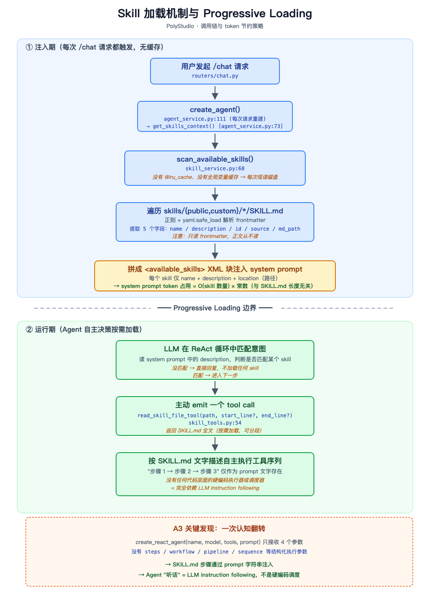
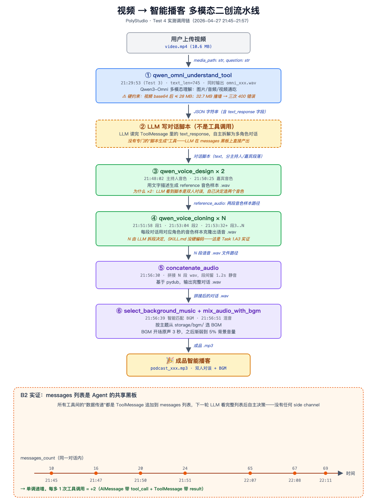

# 第 10 周作业 · 解答

> 关联文档：[作业要求](作业要求.md)
> 关联代码：`~/development/AIGC/learning/AI_Video/week-10/gradio-mini-agent/`
> GitHub 提交仓库：（待填）

---

## Task 1 · Skill 系统与多模态联动分析

### Skill 加载与执行机制

下面三段是我读完代码后按"先猜测、再验证、再修正"的顺序整理的笔记。

#### A1 · 发现机制：我以为有缓存，结果没有

起初我猜 Skill 应该是**启动时扫一次缓存住**——这是大部分系统的常见做法。但 `grep -rn "get_skills_context" backend/app/` 后只看到两处命中：定义在 [skill_service.py:170](backend/app/services/skill_service.py#L170)，调用方在 [agent_service.py:73](backend/app/services/agent_service.py#L73)。再往上追，调用 `get_skills_context()` 的 `create_agent()` 又被 [agent_service.py:111](backend/app/services/agent_service.py#L111) 在每次 `process_chat_stream` 里**重新触发**。

读到 [scan_available_skills](backend/app/services/skill_service.py#L68) 才真正意识到：**它没有 `@lru_cache`、没有全局变量、什么缓存都没有**——每次都现读磁盘，遍历 `skills/public/` 和 `skills/custom/`，用正则 + `yaml.safe_load` 解析 frontmatter，提取 name / description / id / source / md_path 五个字段。这"看似低效"的设计正是为了让用户在设置页改了 Skill 启用开关后**不需要重启服务**——这就是 README 里"Skill 修改后无需重启"的实现机制。

#### A2 · Progressive Loading：原来"渐进"是这样省 token 的

我对 "Progressive Loading" 这个词最初的理解很模糊，以为是某种"分块加载"。读完 [get_skills_context](backend/app/services/skill_service.py#L170) 才搞清楚：

它注入到 system prompt 里的 XML 块**只含元数据**——每个 skill 一个 `<skill>` 节点，仅 name + description + location（SKILL.md 路径），**正文一个字节都不进 prompt**。

那 Agent 怎么获取完整工作流？答案在 [skill_tools.py:54](backend/app/tools/skill_tools.py#L54) 的 `read_skill_file_tool`——一个标准的 LangChain `@tool`，签名是 `(path, start_line?, end_line?) -> str`。Agent 在 ReAct 循环里**自己**判断"我该读这个 SKILL.md 了"，然后主动 emit 一个 tool call。

意外发现这个工具甚至支持按行范围读取——SKILL.md 很长时还能分段加载。所以 system prompt 的 token 占用是常数级，**与 skill 数量、SKILL.md 长度都解耦**。这才是 "Progressive" 的精髓。

#### A3 · 工具选择本质：一次认知翻转

我凭直觉觉得"靠 LLM 自觉照做"简直天方夜谭——如果 SKILL.md 写"先调 A 工具再调 B 工具"，怎么可能没有调度器强制执行？所以我猜**有硬编码执行器**。

直到读到 [agent_service.py:82-87](backend/app/services/agent_service.py#L82)：

```python
agent = create_react_agent(name=..., model=..., tools=tools, prompt=full_prompt)
```

只传了 4 个参数。**没有 `steps`、没有 `workflow`、没有 `pipeline`、没有任何描述"按顺序做事"的结构化字段**。SKILL.md 里的"步骤 1→2→3"只能通过 `prompt=full_prompt` 这条路径进来——它就是 prompt 字符串里的一段普通文字。**我猜错了——是纯 prompt 工程**。

这次翻转让我意识到：Skill 系统的可靠性 = LLM 指令遵循能力 × prompt 措辞质量。本质上和 system prompt 第一行写"你是友好助手"是**同一个机制**——都是 instruction following。这也解释了为什么实际开发中会发现 Skill 偶尔不被正确激活——这是 LLM 概率性输出的天然特性，不是"bug"。

#### 调用链与机制图

下图把上面三段的发现整理成一张图：上半部分（蓝色）是"注入期"的同步调用链，下半部分（绿色）是"运行期"Agent 自主按需加载的过程，中间虚线就是 Progressive Loading 的核心边界。



### 多模态联动工作流

下面三段以「智能播客生成」为例。所有结论都来自我两次真实实验的后端日志（`backend/logs/polystudio_20260427.log`），不是凭空推理——失败和成功都有迹可循。

#### B1 · Agent 第一步做什么——一次失败 + 一次成功才看清这个工具

我打开 [tools/qwen_omni_understanding.py](backend/app/tools/qwen_omni_understanding.py) 找入口，[第 223 行](backend/app/tools/qwen_omni_understanding.py#L223) 就是被 `@tool` 装饰的函数：

```python
@tool("qwen_omni_understand", args_schema=QwenOmniUnderstandInput)
def qwen_omni_understand_tool(
    media_path: str,                       # 必填：媒体文件路径
    question: str,                         # 必填：自然语言提问
    media_type: Optional[str] = None,      # 可选：image/audio/video，留空按扩展名自动识别
    output_audio: bool = True,             # 可选：是否同时返回语音回答
    voice: str = "Cherry",                 # 可选：语音音色
) -> str:
```

最初我把 5 个参数都当必填——后来才意识到 Python 语法里**有 `=` 默认值的就是可选**，真正必填只有 `media_path` 和 `question`。这工具支持图片 / 音频 / 视频三类（[docstring 第 234-237 行](backend/app/tools/qwen_omni_understanding.py#L234)）。

返回类型注解写的是 `-> str`，但读到 [第 319-335 行](backend/app/tools/qwen_omni_understanding.py#L319) 才发现里面装的是 `json.dumps(result, ...)`——一个 **JSON 序列化后的字符串**，dict 结构含 `text_response`（主要分析文字）、`media_type`、`audio_url`（可选）等。

我的实验给这两件事都做了实证：

- **失败案例（21:13:21+）**：上传 32.7 MB 视频，三次连续 400 错误：`String value length (28046504) exceeds the maximum allowed (28000000)`。视频 base64 编码后超了百炼 API 的字符串上限 28 MB——**只多了不到 50 KB**。
- **成功案例（21:29:53）**：换成 10.6 MB 视频立刻通过，返回 `text_len=745`，并附带一段 `omni_20260427_212953.wav`（因为 `output_audio` 默认 True）。

这个 28 MB 上限是 Qwen3-Omni 当前的硬约束，以后写 SKILL.md 要在前置检查里挡住超大文件。

#### B2 · 理解结果如何传给下一个工具——message-passing 的"啊哈"时刻

我的直觉是"qwen_omni 的输出会被某段代码塞进下一个工具的入参"——肯定有某个 wiring 逻辑在串。

读 [stream_processor.py](backend/app/services/stream_processor.py) 看到这一行才反应过来：

```python
agent.astream(
    {"messages": langchain_messages},        # ← Agent 的"内存"就是这个 list
    {"recursion_limit": self.recursion_limit},
    stream_mode=["messages"],
)
```

**根本没有"传"，是 LangGraph 的 messages 列表在生长**：

1. `qwen_omni_understand` 返回那串 JSON 字符串
2. LangGraph 把字符串包成一个 `ToolMessage`，**追加到 messages 列表末尾**
3. 下一轮 LLM 被调用时，看到的 input 是**完整的 messages 列表**——包括刚刚那个 ToolMessage
4. LLM **自己**读 JSON 串里的 `text_response`，**自己**决定下一步调哪个工具、**自己**填参数

所以"工具间传递数据"是个错觉。**所有数据都汇集到 messages 这块共享黑板上，每轮 LLM 都看完整黑板，自主决定下一笔。**

我的 Test 4 日志给了这个判断毫不含糊的实证——同一次任务里 `messages_count` 从 10 → 16 → 20 → 24 → 65 → 67 → 69 单调递增，每多一次工具调用就 +2（一个 AIMessage 带 tool_calls + 一个 ToolMessage 带结果）。这个列表就是 Agent 的"记忆"。

旁边的 `recursion_limit=200`（[backend/.env](backend/.env)）则是这块黑板增长的硬上限，防止 LLM 反复调工具陷入死循环。

#### B3 · 从视频到成品播客的完整工具调用链

我的 Test 4（21:45-21:57）实际跑通了一遍——日志里每个时刻都对应一次工具调用，串起来就是这条链：

```
21:45:46  read_skill_file × 2           [Progressive Loading 加载 podcast-creator/SKILL.md]
              ↓
21:48:02  qwen_voice_design             [设计主持人音色样本]
21:50:25  qwen_voice_design             [设计嘉宾音色样本]
              ↓
21:51:58  qwen_voice_cloning            [段 1：开场白]
21:53:04  qwen_voice_cloning            [段 2：曹操诸葛亮场景]
21:53:32+ qwen_voice_cloning            [段 3..N，逐段克隆]
              ↓
21:56:30  concatenate_audio             [把 N 段 wav 拼成完整对话]
              ↓
21:56:39  select_background_music       [按主题智能选 BGM]
21:56:51  mix_audio_with_bgm            [BGM 开场 3 秒后渐弱到 5%]
              ↓
          🎉 成品播客 .mp3
```

读完这条链我有 3 个实打实的发现（每个都同时对应 Task 1.A 里的某条结论）：

1. **第一步是 `read_skill_file` 而不是 `qwen_omni_understand`**——印证了 A1/A2 的 Progressive Loading：Agent 先靠元数据判断匹配，再主动 read 全文拿到工作流，最后才执行业务工具。
2. **`voice_cloning` 不是单次而是多次**——SKILL.md 没有硬编码"做几段"，是 LLM 看完脚本后自己拆段、自己决定调几次。又一次实证了 A3 的"纯 prompt 工程"。
3. **整个流程花了约 12 分钟**——其中 LLM 思考、用户多轮确认占了大头。如果做成无人值守 Skill，理论上能压到 3-5 分钟。**这就是 Task 2 要解决的核心问题。**

### 多模态二创流水线图

把 B1-B3 整合成一张图：每个箭头上方是工具名 + Test 4 实际时刻，下方是数据形态；底部黑板示意 messages 列表的状态共享。



---

## Task 2 · 自动化多模态内容二创 Skill 设计

我选择「直接更新项目」的交付形式——产出物是真实可运行的 Skill：[backend/skills/custom/media2podcast/SKILL.md](backend/skills/custom/media2podcast/SKILL.md)（约 320 行）。本节按"方案 → 设计决策 → SKILL.md 结构 → 实战验证 → 迭代修复"的顺序复盘整个过程。

### 方案与架构

**目标**：编写一个名为 `media2podcast` 的自定义 Skill——当用户上传视频或音频并要求做播客时，Agent 一次性自动完成「多模态理解 → 写脚本 → 合成音色 → 逐段克隆 → 拼接 → 选 BGM → 混音」7 个步骤，全程**无人值守**。

**与现有 Agent 集成方式**：
- 不需要改 Python 代码——Skill 系统是 prompt 工程，新建一个 `SKILL.md` 文件即可被 Agent 自动发现（Task 1.A1 验证过的"无缓存现读"机制）。
- 不需要新增工具——直接复用现有 19 个工具（`qwen_omni_understand` / `qwen_voice_design` / `qwen_voice_cloning` / `concatenate_audio` / `select_background_music` / `mix_audio_with_bgm`）。
- 不需要重启服务——文件写入后下一次对话就能扫到（Test 4 已实证）。

**与现有 `podcast-creator` Skill 的边界划分**：
- `podcast-creator`：用户给主题文字 → 创作播客（**交互式**，每步等用户确认）
- `media2podcast`（我新增）：用户给媒体文件 → 二创播客（**无人值守**，一次跑完）
- 两者通过 `description` 中的关键词区分（"上传的视频或音频" vs. "纯主题文字"）让 LLM 自主分流。

### 设计决策汇总（共 16 个微决策）

下表把 SKILL.md 里所有"为什么这么写"压缩成一行——这些决策的取舍逻辑都是**MVP-first + 成熟方案**。

| # | 决策项 | 取值 | 取舍依据 |
|---|---|---|---|
| 1 | Skill ID | `media2podcast` | 兼容视频/音频两类输入 |
| 2 | description 关键词 | "上传"+"自动"+"无需中途干预" | 与 podcast-creator 错位触发 |
| 3 | 工具链复用策略 | A·完全独立写指令 | 复用 podcast-creator 会带来"等待确认"反污染 |
| 4 | 文件大小阈值 | 25 MB | 比 API 28MB 上限留 3MB 余量 |
| 5 | 文件类型白名单 | mp4/m4v/mov/avi/mkv/webm/mp3/m4a/wav | 覆盖 qwen_omni 文档列出的全部支持类型 |
| 6 | 播客形式 | 单人独白（非对谈） | MVP，省 50% API 成本 |
| 7 | 脚本字数 | 500 字（450-550） | 对应约 3 分钟 TTS 时长 |
| 8 | 脚本拆段方式 | 双换行 `\n\n` | 最简，不需后期处理 |
| 9 | 主持人音色 | 亲切自然女声 | 泛主题适配最好 |
| 10 | 音色样本来源 | 选项 2（独立 voice_design + 全 N 段都 voice_cloning） | 一致性 > 省钱 |
| 11 | 段间静音时长 | 1200 ms | Test 4 实测默认，业内主流 |
| 12 | BGM 选择策略 | LLM 按主题自动匹配 | 直接复用工具内置能力 |
| 13 | 混音方案 | README 标准（开场 3s 原声 + 渐弱到 5%） | 商业播客主流模板 |
| 14 | 单段克隆失败 | 重试 1 次 | 1 次拿走 70% 瞬时抖动收益，3 次性价比骤降 |
| 15 | BGM 库为空 | 优雅降级（无 BGM 版本） | 业内通用 graceful degradation |
| 16 | 邮件通知 | TODO 延后 | 当前工具集没有 send_notification_tool |

### SKILL.md 结构（实际产出）

```
---
name: media2podcast
description: 根据上传的视频或音频自动二创播客，全程一次性完成、无需中途干预。
---

# 媒体到播客的自动二创

## ⚠️ 铁律（贯穿全流程，绝不破例）  ← 实战暴露漏洞后新增
## 适用场景
## 核心工作流程
   ### 第 1 步 · 前置检查（门禁拦截）
   ### 第 2 步 · 多模态理解（qwen_omni_understand）
   ### 第 3 步 · LLM 写脚本（不调工具）
   ### 第 4 步 · 设计音色样本（qwen_voice_design × 1）
   ### 第 5 步 · 逐段克隆（qwen_voice_cloning × N，重试 1 次）
   ### 第 6 步 · 拼接（concatenate_audio）
   ### 第 7 步 · 添加 BGM 并输出（select_bgm + mix_audio）
## 默认值汇总（无人值守清单，15 项）
## 禁止行为汇总
## 失败兜底汇总
## TODO（未来扩展，本期不做）
```

每一步包含 4 元素：**目标 / 调用工具 + 参数 / 默认值（无人值守关键）/ 完成条件 / 失败兜底**。

### 实战验证 + 迭代修复（最有价值的部分）

我没止步于"写完 SKILL.md"，而是**真机测了一次，并复盘日志暴露的设计漏洞**——这个迭代过程比"一次跑通"更能体现 Task 1.A3 翻转里讲的"纯 prompt 工程的脆弱性"。

#### 第一次实测（22:22:03 - 22:23:51，7.5 MB MP3 输入）

后端日志显示**前 4 步顺利**：
```
22:22:14  read_skill_file → 命中 media2podcast    ✅ Skill 被 Agent 主动加载
22:22:21  Step 1 前置检查通过                     ✅ 文字 self-check 写出来了
22:22:36  qwen_omni_understand                   ✅ 参数完全按 SKILL.md 固定 question
22:23:24  Omni 返回 text_len=3258                 ✅
22:23:27  Agent 开始 step 3 写脚本                ✅
22:23:51  ⚠️ 流式完成——Agent 把脚本作为最终答复给用户停下了
```

**Agent 没继续调 voice_design 进入 Step 4**——它**把脚本输出当成最终交付**，认为任务结束。

#### 暴露的两个 SKILL.md 设计漏洞

| 漏洞 | 现象 | 根因 |
|---|---|---|
| **漏洞 1：中途停下** | 写完脚本就交差 | SKILL.md 没强约束"必须 7 步全跑完才算结束"；LLM 自主决定停下来 |
| **漏洞 2：跳过前置检查** | 之前一次实测，Agent 没核对文件大小直接调 omni（撞上 28MB 限制） | Step 1 没强制要求"文字 self-check 后再继续" |

**这两个漏洞印证了 Task 1.A3 的核心结论**——SKILL.md 是 prompt 文字、不是硬编码状态机，LLM 完全可以"理解错"步骤边界。可靠性 = LLM 指令遵循能力 × prompt 措辞质量。

#### 迭代修复（在 SKILL.md 注入 3 段更"凶"的指令）

1. **顶部增加「⚠️ 铁律」段**（紧贴 frontmatter 之后）——5 条贯穿全流程的硬规则，第 1 条就是"必须 7 步全部完成才能向用户交付，任何中间产出都不是最终答案"
2. **Step 1 增加「强制核对」**——要求 Agent 在调用任何工具之前明确写出 "前置检查通过：路径=X，类型=Y，大小=Z MB"
3. **Step 3 末尾增加「关键提醒」**——直接对 LLM 说话："如果你刚写完脚本，正在考虑'是不是该把脚本告诉用户'——停止这个念头，立即调 qwen_voice_design_tool"

第 3 条这种"对 LLM 喊话"式 prompt 措辞**反直觉但有效**——业内称为 anthropomorphic instruction，强制干预 LLM 的"思考惯性"。

### 集成改动点

| 改动 | 路径 | 影响 |
|---|---|---|
| 新增 SKILL.md | `backend/skills/custom/media2podcast/SKILL.md` | 自动被 [skill_service.py:68](backend/app/services/skill_service.py#L68) 扫到，无需重启 |
| Python 代码 | **无改动** | 完全靠 prompt 工程实现 |
| 新增工具 | **无新增** | 复用现有 19 个工具 |
| 设置页启用 | [http://localhost:3000](http://localhost:3000) → Skills → 启用 `media2podcast` | 状态写入 `backend/storage/settings.json` |

---

## 自查清单

- [ ] Task 1 分析约 200 字
- [ ] Task 1 配流程图
- [ ] Task 2 任选一种或组合交付
- [ ] 推送到 GitHub / Gitee 并填入仓库链接
- [ ] 在作业评论框提交链接
